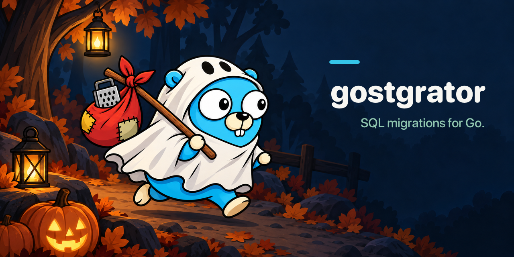

# gostgrator
[![Actions Status][action-img]][action-url]
[![SocketDev][socket-image]][socket-url]
[![PkgGoDev][pkg-go-dev-img]][pkg-go-dev-url]

[action-img]: https://github.com/bcomnes/gostgrator/actions/workflows/test.yml/badge.svg
[action-url]: https://github.com/bcomnes/gostgrator/actions/workflows/test.yml
[pkg-go-dev-img]: https://pkg.go.dev/badge/github.com/bcomnes/gostgrator
[pkg-go-dev-url]: https://pkg.go.dev/github.com/bcomnes/gostgrator
[socket-image]: https://socket.dev/api/badge/go/package/github.com/bcomnes/gostgrator?version=v1.0.2
[socket-url]: https://socket.dev/go/package/github.com/bcomnes/gostgrator?version=v1.0.2

**gostgrator**: A low dependency, go stdlib port of [postgrator](https://github.com/rickbergfalk/postgrator) supporting postgres and sqlite.

## Install with Homebrew

Install both database-specific commands from the [`bcomnes/tap`](https://github.com/bcomnes/homebrew-tap) tap:

```console
brew install bcomnes/tap/gostgrator
gostgrator-pg -help
gostgrator-sqlite -help
```

This adds the tap automatically.
Update both commands later with `brew upgrade gostgrator`.

## Migrations

Migrations can live in any folder in your project.
The default is `./migrations`.
Migration files are named `001.do.some-optional-description.sql` and `001.undo.some-optional-description.sql` and come in up and down pairs.
The files should contain SQL appropriate for the database you are running them

```console
./migrations
├── 001.do.sql
├── 001.undo.sql
├── 002.do.some-description.sql
├── 002.undo.some-description.sql
├── 003.do.sql
├── 003.undo.sql
├── 004.do.sql
├── 004.undo.sql
├── 005.do.sql
├── 005.undo.sql
├── 006.do.sql
└── 006.undo.sql
```

### Migration Transactions

gostgrator (like postgrator), applies no special or magic transaction around your migrations, other than running multiple statements from a file in one execution which postgres will treat as a transaction.
If you need stricter behavior than this, or are migrating databases that don't have this behavior, wrap your migrations in explicite BEGIN/END blocks.

## gostgrator CLI

gostgrator is intended to be installed and versioned as a [go tool](https://go.dev/doc/go1.24#go-command).

Each supported database has it's own CLI you can install.

### gostgrator/pg

The `gostgrator/pg` cli provides migration support for [Postgres](https://www.postgresql.org).

```console
go get -tool github.com/bcomnes/gostgrator/pg
go tool github.com/bcomnes/gostgrator/pg -help
Usage:
  gostgrator-pg [command] [arguments] [options]

Commands:
  migrate [target]    Migrate the schema to a target version (default: "max").
  down [steps]        Roll back the specified number of migrations (default: 1).
  new <desc>          Create a new empty migration pair with the provided description.
  drop-schema         Drop the schema version table.
  list                List available migrations and annotate the migration matching the database version.

Options:
  -config string
    	Path to JSON configuration file (optional)
  -conn string
    	PostgreSQL connection URL. Can be set with DATABASE_URL env var.
  -help
    	Show help message
  -migration-pattern string
    	Glob pattern for migration files when running up or down migrations (default "migrations/*.sql")
  -mode string
    	Migration numbering mode ("int" or "timestamp") when creating new migrations (default "int")
  -schema-table string
    	Name of the schema table migration state is stored in (default "schemaversion")
  -version
    	Show version
```

### gostgrator/sqlite

```console
go get -tool github.com/bcomnes/gostgrator/sqlite
go tool github.com/bcomnes/gostgrator/sqlite -help
Usage:
  gostgrator-sqlite [command] [arguments] [options]

Commands:
  migrate [target]    Migrate the schema to a target version (default: "max").
  down [steps]        Roll back the specified number of migrations (default: 1).
  new <desc>          Create a new empty migration pair with the provided description.
  drop-schema         Drop the schema version table.
  list                List available migrations and annotate the migration matching the database version.

Options:
  -config string
    	Path to JSON configuration file (optional)
  -conn string
    	SQLite connection URL (typically a file path, e.g., "./db.sqlite"). Can also be set via SQLITE_URL env var.
  -help
    	Show help message
  -migration-pattern string
    	Glob pattern for migration files (default "migrations/*.sql")
  -mode string
    	Migration numbering mode ("int" or "timestamp") for new command (default "int")
  -schema-table string
    	Name of the schema table (default "schemaversion")
  -version
    	Show version
```

## Quick tour

```console
# migrate to latest in ./migrations using DATABASE_URL
go tool github.com/bcomnes/gostgrator/pg migrate

# rollback the last two migrations
go tool github.com/bcomnes/gostgrator/pg down 2

# create a timestamp‑based pair
go tool github.com/bcomnes/gostgrator/pg -mode timestamp new "add-users-table"

# list all migrations and mark current
gostgrator-pg list
```


## Library usage

Full API docs live on [PkgGoDev][pkg-go-dev-url].

### Typed migration sources

Set `Config.Migrations` to a `MigrationSource` to choose where SQL migrations are read.
Use `DiskMigrations{Pattern: "migrations/*.sql"}` for local files or `FSMigrations{FS: migrationFS, Pattern: "migrations/*.sql"}` for an `fs.FS`, including `embed.FS`, `os.DirFS`, or `fstest.MapFS`.
Both values and nonnil pointers to these source types are accepted.

```go
cfg := gostgrator.Config{
    Driver: "sqlite",
    Migrations: gostgrator.DiskMigrations{
        Pattern: "migrations/*.sql",
    },
}
g, err := gostgrator.NewGostgrator(cfg, db)
if err != nil {
    return err
}
_, err = g.Migrate(ctx, "max")
```

`DiskMigrations.Pattern` uses filesystem glob paths, including relative or absolute paths.
`FSMigrations.Pattern` uses slash-separated paths relative to the supplied filesystem root, with no leading slash or `.` or `..` path components.
For example, use `migrations/*.sql`, not `./migrations/*.sql`.
Use `fs.Sub` to select a subtree and then match `*.sql` relative to that subtree.
Glob patterns follow `filepath.Glob` for disk and `fs.Glob` for `fs.FS`; `**` is not a recursive wildcard.
Explicit sources require nonempty patterns, and `FSMigrations` requires a nonnil filesystem.
Nil source pointers are invalid.

When `Config.Migrations` is nil, the legacy `Config.MigrationPattern` remains supported, so existing library configurations do not need to change.
Setting both `Migrations` and a nonempty `MigrationPattern` is an error rather than a precedence rule.
The CLI continues to use `-migration-pattern`; typed sources are a Go library API.

### Embed migrations in a binary

Given a `migrations` directory beside this Go source file, embed the SQL files and pass the filesystem to `FSMigrations`:

```go
package database

import (
    "context"
    "database/sql"
    "embed"

    "github.com/bcomnes/gostgrator"
    _ "modernc.org/sqlite"
)

//go:embed migrations
var migrations embed.FS

func Migrate(ctx context.Context, db *sql.DB) error {
    g, err := gostgrator.NewGostgrator(gostgrator.Config{
        Driver: "sqlite",
        Migrations: gostgrator.FSMigrations{
            FS:      migrations,
            Pattern: "migrations/*.sql",
        },
        ValidateChecksums: true,
    }, db)
    if err != nil {
        return err
    }
    _, err = g.Migrate(ctx, "max")
    return err
}
```

The example expects a SQLite connection opened with `sql.Open("sqlite", ...)`.
The directory directive embeds eligible files recursively, but `migrations/*.sql` only selects migrations directly inside that directory.
Directory embedding excludes dotfiles and underscore-prefixed files by default; use `//go:embed all:migrations` if those are needed.
Embedding paths are relative to the package containing the directive and cannot escape it using `..`.
Changing embedded migrations requires rebuilding the binary.
Embedded SQL is built into the binary and does not require migration files in the runtime working directory.
Use `g.Migrate(ctx, "0")` to apply the undo migrations back to version zero, or `g.Down(ctx, 1)` to roll back one version step.
File naming, migration ordering, duplicate version/action detection, and checksum validation work the same way for disk and filesystem sources.
`Config.Newline` normalizes content for checksum calculation without rewriting the SQL executed against the database.
Migrations returned by `GetMigrations` retain their source for later `RunMigrations` calls, even when passed to a different runner.
A manually constructed `Migration` without a retained source reads its `Filename` from disk.

### Create migration files

`CreateMigration` supports explicit `DiskMigrations` as well as the legacy `MigrationPattern`:

```go
err := gostgrator.CreateMigration(gostgrator.Config{
    Migrations: gostgrator.DiskMigrations{Pattern: "migrations/*.sql"},
}, "Add users", "int")
```

The migration directory must already exist.
Use `"timestamp"` instead of `"int"` for Unix timestamp numbering.
`CreateMigration` rejects `FSMigrations`, including filesystems backed by disk, because the `fs.FS` interface is read-only.
Create files through a disk source during development, then rebuild the binary to update embedded migrations.

---

## Why another migrator?

* **CLI ‑ first** – instant productivity; no boilerplate code required.
* **Typed Go API** – embed migrations programmatically when you need to.
* **Checksum validation** – MD5 guardrails ensure applied migrations never drift.
* **Up ⬆ / Down ⬇ parity** – every migration pair keeps rollbacks honest.
* **Zero dependencies** – a single static binary per database driver.

## License

MIT © Bret Comnes 2025

## Mascot


